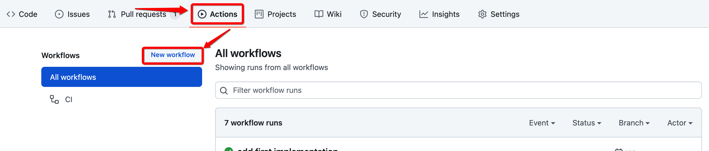
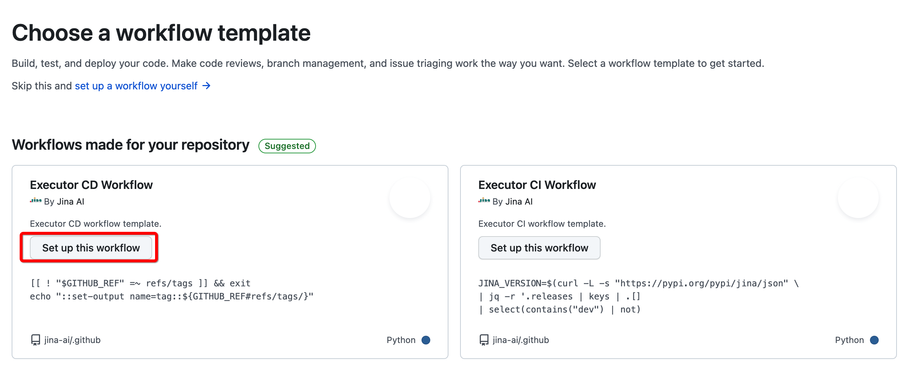
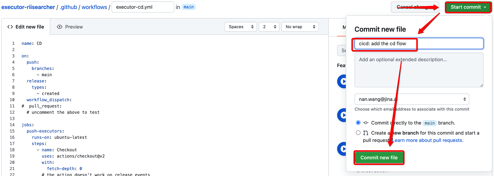

# Jina AI GitHub Workflow Templates

Share the workflow templates from Jina AI

## Add `Executor CD Workflow`

1. Go to the `Action` of the executor's repository Click on `New Workflow`. 
   
2. Choose the `Executor CD Workflow`
   
3. Modify the commit message and make a commit to the `main` branch
   

## Add `Executor CI Workflow`

The same as above except choosing `Executor CI Workflow` at Step-2.

## Reference:
- [Sharing workflows with your organization](https://docs.github.com/en/actions/learn-github-actions/sharing-workflows-with-your-organization)